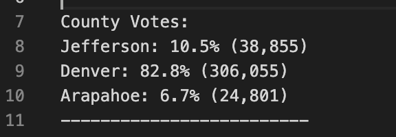
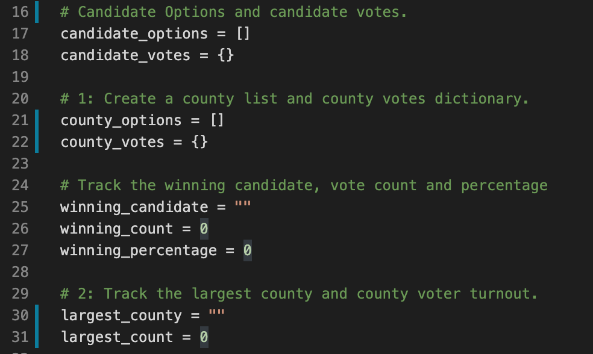

# Written Analysis
 
## Overview of Election Audit

We are helping Tom as he runs an election audit on a U.S. congressional district in Colorado. Our initial analysis used python to automate task in order for us to report the total votes casted, the total votes and percentage of votes for each candidate, finally we were able to certify the winner of the election. Our initial script was able to smoothly run through the ballot results, and certify the winner of the election. Now we are charged with running a similar analysis to find out how other districts faired in their elections. 

## Election-Audit Results

### County Breakdown

- 3 counties analyzed: Jefferson, Denver, and Arapahoe. 
- The congressional election saw 369,711 votes casted.
- Denver had a staggering 82.6% of the votes casted as the county racked in 306,055 total votes.

It is clear that Denver was the most influential county in the congressional election. 

### Smaller Counties

The other counties naturally did not have much votes left considering the overwhelming amount of votes that pored in from Denver county as compared to our total number of votes. Jefferson coounty is the second most populus county in our election, and Jefferson county gained 38,855 votes for 10.5% of the votes. Finally we have Arapahoe with 24,801 total votes casted, and 6.7% of the total votes. 

### Election Candidate Results 

Charles Casper earned 23% of the votes, with 85,213 votes casted in his honor, earning Charles Casper 2nd place in the election. We see that Raymond Anthony Doane won 11,606 votes, earning him 3.1% of the total votes.

### Winning Candidate

- We certified Diana DeGette as the overwhelming winner. Considering Diana won in such an overwhelming margin, with 73.8% of the total votes, which amounts to 272,892 votes.

## Election-Audit Summar
  
  This script has shown it's ability to be adaptable when expansion is the goal. In order to handle additional districts we simply need to assign new variables and run similar for loops in order to run new analysis. In our analysis here it was a simple test where we ran similar code like we did before, but used new variables and iterated through the counties rather than candidates. See the variables that we assigned to each county below. 

If more data needed to be analyzed outside of our file we would not need to deviate too far from our original script. Pythons built in functions allows us to read and write on files as we please, so an expansion of data would require us to simply read new data and adjust the variables assigned accordingly in order to run similar analysis on different districts. 

